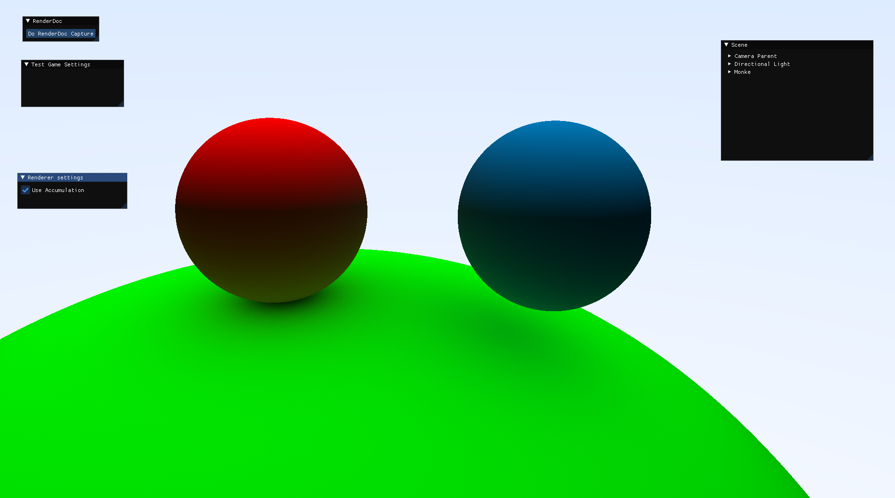
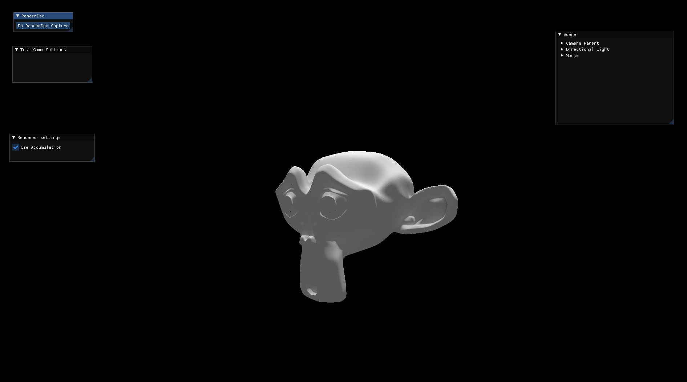
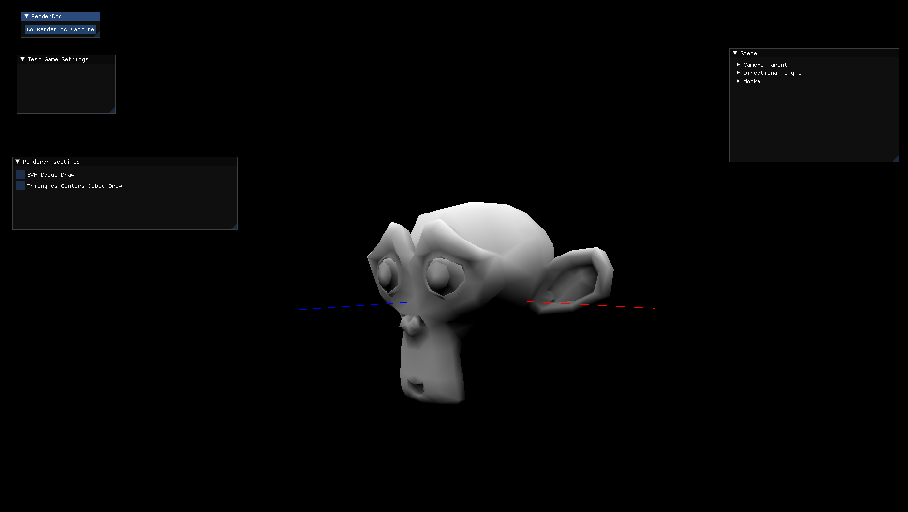
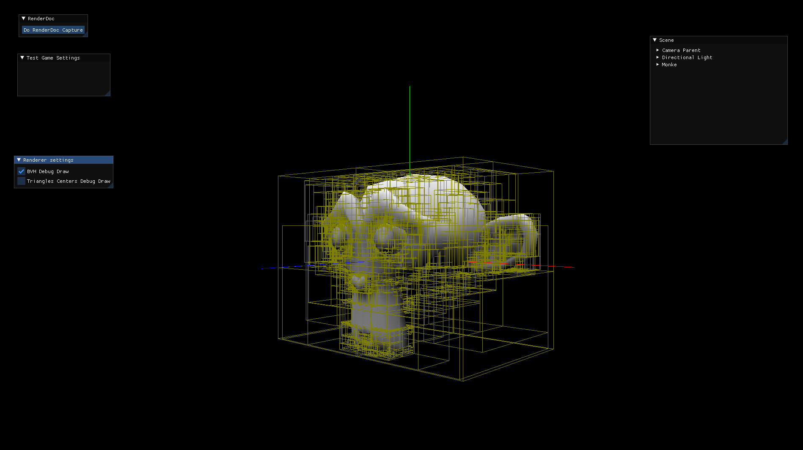

# Spherical-Harmonics-Monte-Carlo-Pathtracer
A Spherical Harmonics based lighting renderer that uses a Path Tracer with Monte Carlo sampling.   
Additionally, the Path Tracer can be used on its own, with accumulation.

Path tracer with Monte Carlo sampling and accumulation:  

  

  
Spherical Harmonics based lighting for models:
  

  
BVH Based Acceleration structure building for Tracing:
  

